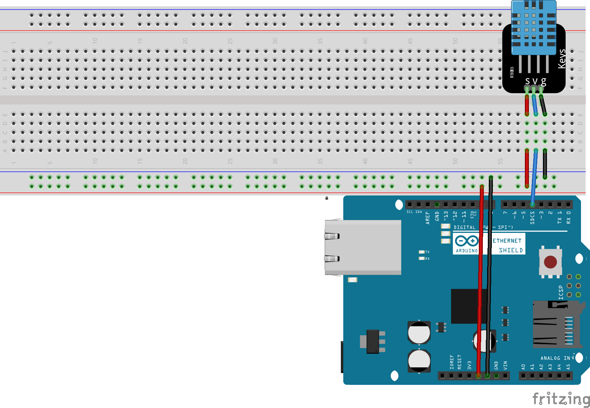

# modified-arduino-webserver

this is a modified version of the [arduino webserver example](https://docs.arduino.cc/tutorials/ethernet-shield-rev2/WebServer#warning)

schematic for Temperature and Humidity 

parts used:

<ul>
  <li>arduino uno or mega</li>
  <li>ethernet shield compatible with the <a href="https://www.arduino.cc/en/Reference/Ethernet">arduino ethernet library </a> </li>
  <li>dht11 temperature and humidity sensor</li>
  <li>about 8 wires</li>
</ul>

[this library is needed](https://github.com/adidax/dht11) for the dht11 sensor.

